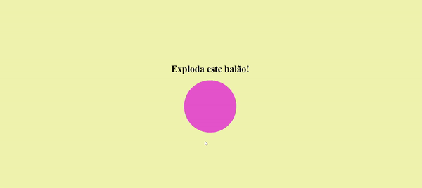
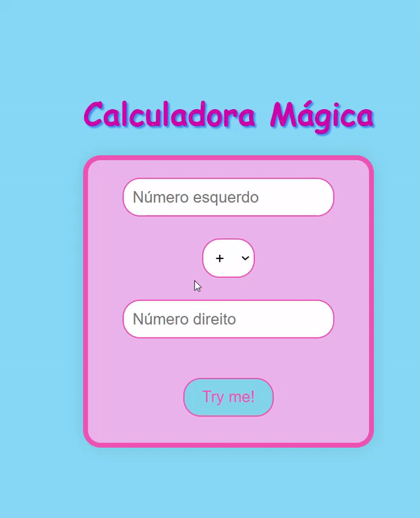
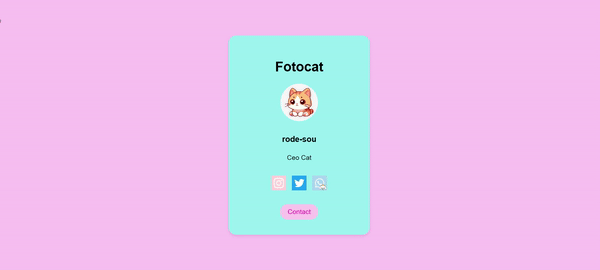
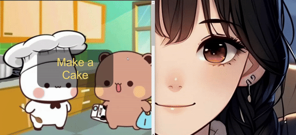
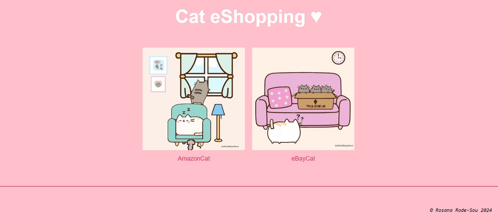
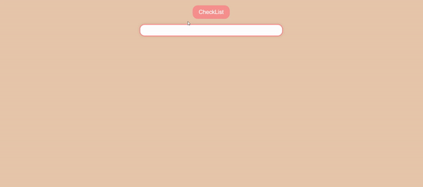
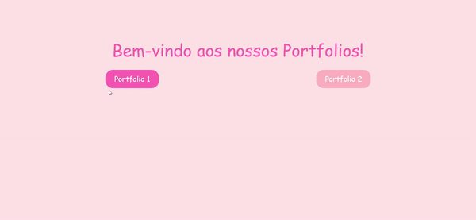

# Missão42 - Componentes e Conteúdo:

A escola 42 é presencial, sem professores. Com isso, ela simula um ambiente de trabalho. Para avançar, precisamos abrir lotes (agendar horários para avaliar e ser avaliado em cada projeto cumprido). Cada avaliação feita soma um ponto, e cada avaliação recebida, perde um ponto. Os pontos são importantes para ser avaliado e seguir para os próximos desafios, logo, não podemos ficar zerados. Apenas no RUSH, projeto final, que é preciso  receber 2 avaliações, por ser feito em dupla.

## Componentes do Projeto:

Missão42 é composto por várias células, cada uma focada em diferentes aspectos do desenvolvimento web e programação shell.

- **Cellule0: Shell** - Fundamentos do uso do shell (Linux) para operações básicas no terminal.
- **Cellule1: HTML and CSS** - Desenvolvimento web com HTML e CSS.
- **Cellule2: HTML, CSS, and JavaScript** - Aprofundamento em desenvolvimento web adicionando interatividade com JavaScript.
- **Cellule3: HTML, CSS, and JavaScript** - Continuação do desenvolvimento web com foco em projetos mais complexos.
- **Cellule4: Rush** - Desafios intensivos para aplicar o conhecimento adquirido sob pressão de tempo.

## Linguagens e Tecnologias

A Missão 42 abrange linguagens e tecnologias essenciais para o desenvolvimento web e automação de tarefas no shell.

- **Linguagens:**
  - C
  - Shell
  - HTML
  - CSS
  - JavaScript
  - jQuery

- **Tecnologias:**
  - Shell para automação e tarefas de linha de comando.
  - HTML e CSS para estruturação e estilização de páginas web.
  - JavaScript e jQuery para adicionar interatividade às páginas web.

## 🎬 **Vídeos (Gifs) dos Principais Projetos:** 🎬

### Parte 1

  
  

### Parte 2

  
  

### Parte 3

  
  

### Parte 4

  
  

### Projeto Final - O RUSH (PORTFOLIOS EM DUPLA):

  

 

## Licença:

Este projeto está licenciado sob a licença MIT. Veja o arquivo [LICENSE](LICENSE) para mais detalhes.
